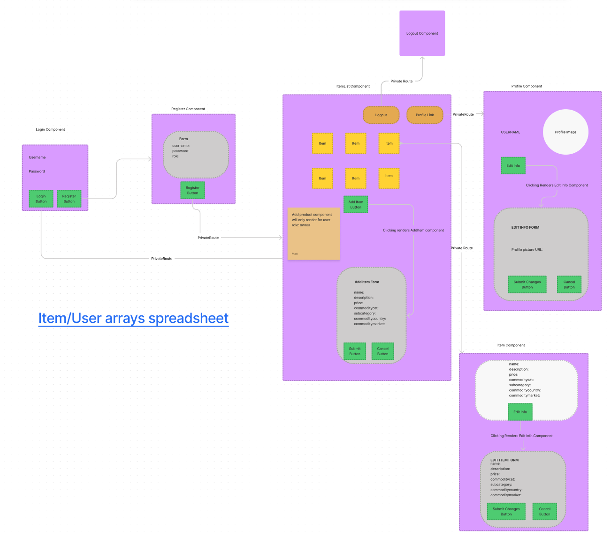

## African Marketplace (Front End)

## ☝️ **Pitch**

Sauti Africa empowers small business owners, particularly women, to improve their business and economic opportunities to grow out of poverty. 

You will build a platform to enable these business owners to create listing for items they have for sale. 

## ✅  **MVP**

1. A small business `owner` can login and see relevant prices in various categories to help them set their own prices.

2. They can also make listing for `items` they want to sell, which will show up to all `users`.

3. They add a new `item` by selecting their market `location` and typing in their item's `name`, `description`, and `price`.

## 🏃‍♀️ **Stretch**

1. A business `owner` can upload their `picture` to their profile.

## App-Flow Diagram

The following chart describes initial planning for the overall user experience, and is subject to change as development progresses.

